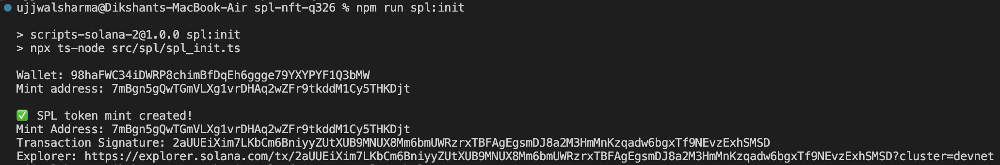
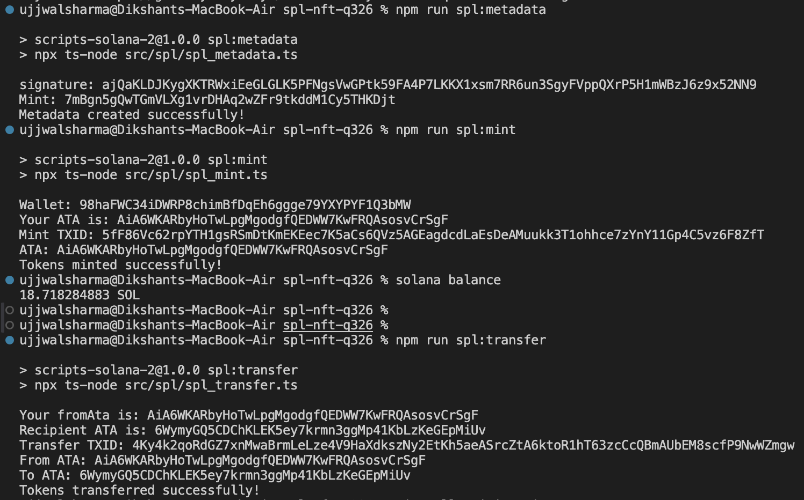
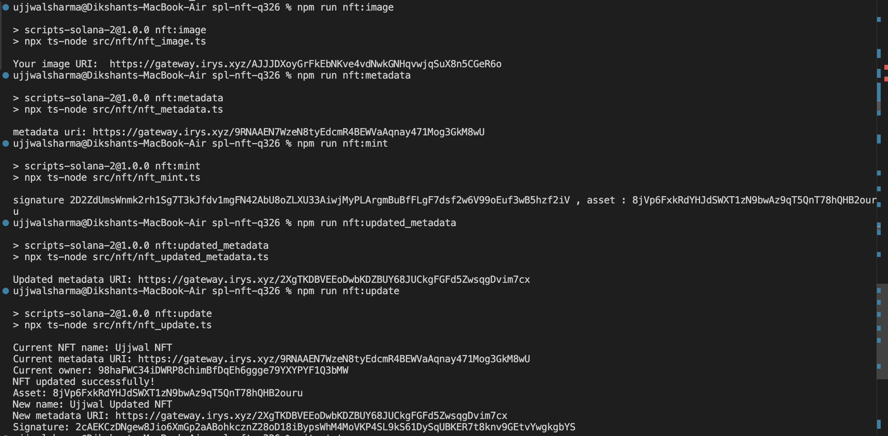
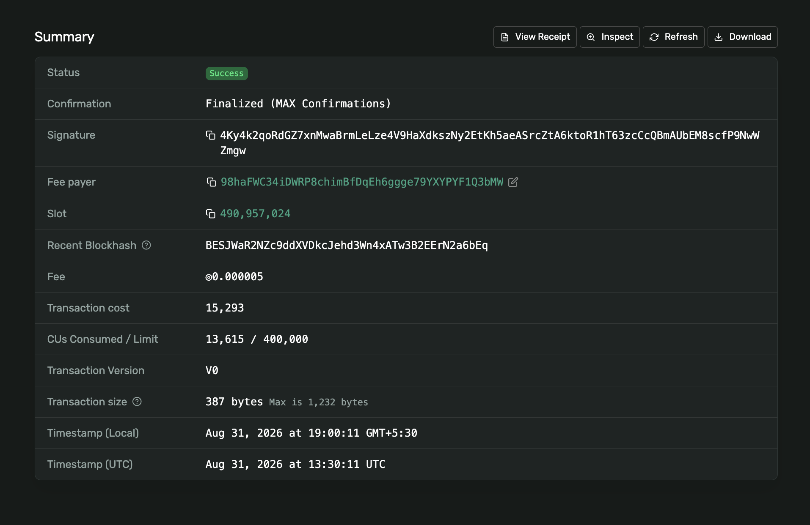
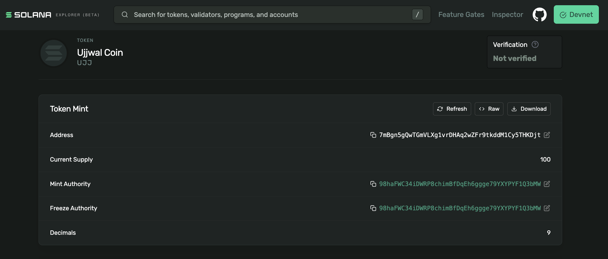
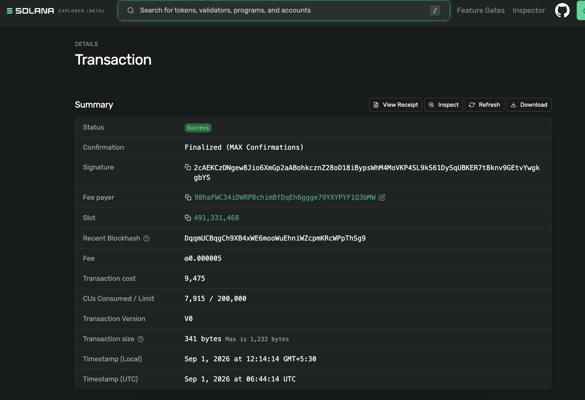
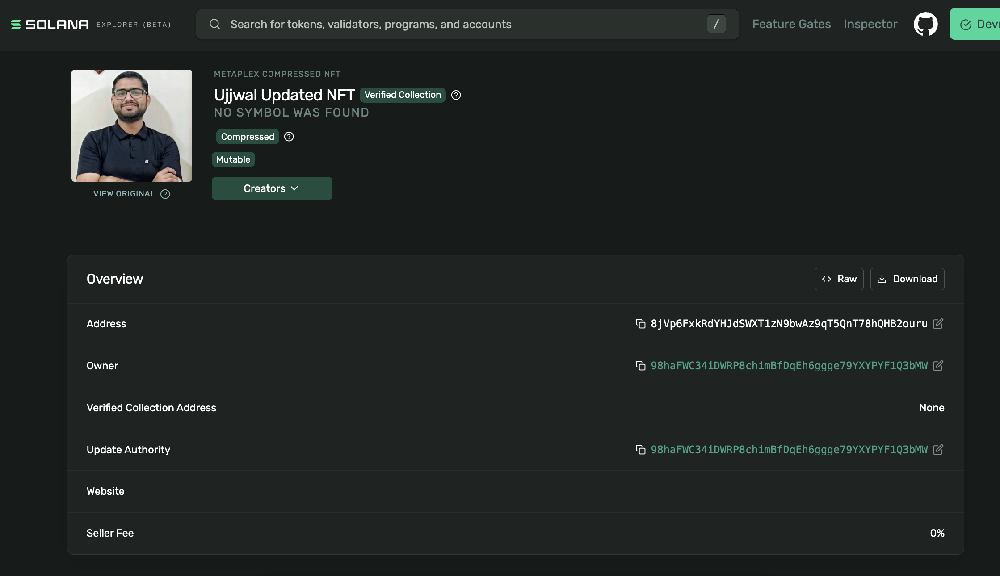

# Solana SPL Token & Metaplex Core NFT Assignment

A hands-on Solana Devnet project covering the complete lifecycle of:

- Creating and initializing an SPL token mint.
- Adding Metaplex Token Metadata to the SPL token.
- Creating an Associated Token Account (ATA) and minting SPL tokens.
- Transferring SPL tokens from one ATA to another.
- Uploading an NFT image to Irys.
- Creating and uploading NFT metadata to Irys.
- Minting an NFT using **Metaplex Core (MPL Core)**.
- Updating the NFT's on-chain name and metadata URI as the update authority.

This repository was completed against **Solana Devnet**. Devnet is used for development/testing and may reset over time, so the addresses and transactions documented below are evidence of this particular run rather than mainnet assets.

---

## Assignment

### Required

1. Mint and transfer your own SPL token.
2. Mint an NFT using MPL Core.
3. Update the NFT's name and metadata as the update authority.

### Optional extension

4. Recreate the NFT flow.
5. Transfer NFT ownership between wallets.
6. Permanently destroy the NFT and reclaim the rent fees.

### Submission requirement

- Attach the repository with a well-written `README.md`.
- Include a screenshot showing all tests/scripts passing.

**Status:** All required tasks are completed ✅

## Verification

### SPL Token Tests




### NFT Tests



### SPL Transfer



### MPL Core NFT




### NFT Update



---

# Table of Contents

- [Project Overview](#project-overview)
- [Tech Stack](#tech-stack)
- [Repository Structure](#repository-structure)
- [Concepts](#concepts)
- [Prerequisites](#prerequisites)
- [Installation](#installation)
- [Wallet and Security](#wallet-and-security)
- [Configuration](#configuration)
- [SPL Token Flow](#spl-token-flow)
  - [1. Initialize the Mint](#1-initialize-the-mint)
  - [2. Add SPL Token Metadata](#2-add-spl-token-metadata)
  - [3. Create ATA and Mint Tokens](#3-create-ata-and-mint-tokens)
  - [4. Transfer Tokens](#4-transfer-tokens)
- [NFT Flow](#nft-flow)
  - [1. Upload the Image](#1-upload-the-image)
  - [2. Create and Upload NFT Metadata](#2-create-and-upload-nft-metadata)
  - [3. Mint the MPL Core NFT](#3-mint-the-mpl-core-nft)
  - [4. Create Updated Metadata](#4-create-updated-metadata)
  - [5. Update the NFT](#5-update-the-nft)
- [Execution Commands](#execution-commands)
- [Completed On-Chain Results](#completed-on-chain-results)
- [Metadata Architecture](#metadata-architecture)
- [What Each Script Does](#what-each-script-does)
- [Verification](#verification)
- [Troubleshooting](#troubleshooting)
- [Security Notes](#security-notes)
- [Dependency / Audit Notes](#dependency--audit-notes)
- [Learning Takeaways](#learning-takeaways)
- [Official References](#official-references)
- [Next Steps](#next-steps)

---

# Project Overview

The project demonstrates two related but different asset models on Solana:

## SPL Token

An SPL token is represented by a **mint account**. The mint defines properties such as decimals and authorities. Token balances are not stored directly on the wallet address; they are stored in token accounts, and the standard wallet-owned token account used here is an **Associated Token Account (ATA)**.

The SPL flow implemented here is:

```text
Wallet
  │
  ├── creates/funds Mint Account
  │        │
  │        └── initializes token properties
  │
  ├── creates Token Metadata
  │
  ├── creates ATA
  │        │
  │        └── holds UJJ tokens
  │
  └── transfers UJJ
           │
           └── Recipient ATA
```

## Metaplex Core NFT

The NFT flow uses **Metaplex Core**, where the NFT is a Core Asset account. Off-chain metadata is stored as JSON and referenced from the asset by a URI.

The NFT flow implemented here is:

```text
image.jpeg
   │
   └── nft_image.ts
          │
          └── Irys image URI
                 │
                 └── nft_metadata.ts
                        │
                        └── Irys metadata URI
                               │
                               └── nft_mint.ts
                                      │
                                      └── MPL Core Asset
                                             │
                                             └── nft_update.ts
                                                    │
                                                    └── updated name + URI
```

---

# Tech Stack

- **Solana Devnet** — blockchain/network used for the assignment.
- **Solana Kit (`@solana/kit`)** — transaction construction, signing and RPC interaction for the SPL token scripts.
- **`@solana-program/token`** — SPL Token instructions such as mint initialization, ATA creation, minting and checked transfers.
- **Metaplex Umi** — JavaScript/TypeScript client framework used by the Metaplex scripts.
- **Metaplex Token Metadata (`@metaplex-foundation/mpl-token-metadata`)** — attaches name/symbol/URI metadata to the SPL token mint.
- **Metaplex Core (`@metaplex-foundation/mpl-core`)** — creates and updates the NFT/Core Asset.
- **Irys via Metaplex Umi uploader** — stores NFT image and JSON metadata off-chain and returns public URIs.
- **TypeScript / `ts-node` / `tsx`** — execution environment for the scripts.

---

# Repository Structure

```text
spl-nft-q326/
├── src/
│   ├── nft/
│   │   ├── nft_image.ts              # Upload NFT image to Irys
│   │   ├── nft_metadata.ts           # Create/upload initial NFT metadata
│   │   ├── nft_mint.ts               # Mint the MPL Core NFT
│   │   ├── nft_updated_metadata.ts   # Upload updated metadata JSON
│   │   └── nft_update.ts             # Update NFT name + URI
│   │
│   └── spl/
│       ├── spl_init.ts                # Create + initialize SPL mint
│       ├── spl_metadata.ts            # Create Metaplex token metadata
│       ├── spl_mint.ts                # Create ATA + mint tokens
│       ├── spl_transfer.ts            # Transfer tokens ATA → ATA
│       └── upload_metadata.ts         # Irys JSON upload helper
│
├── devnet-wallet.json                # Local wallet keypair — DO NOT COMMIT
├── image.jpeg                        # NFT image
├── metadata.json                     # Initial NFT metadata
├── updated_metadata.json             # Updated NFT metadata
├── package.json
├── package-lock.json
├── tsconfig.json
├── .gitignore
└── README.md
```

> `devnet-wallet.json` contains private key material and must never be published.

---

# Concepts

## Mint address vs token account

The **mint address** identifies the token itself. It does not hold a wallet balance.

The **ATA** belongs to a specific owner + mint combination and stores the token balance for that owner.

For this project:

```text
Mint:
7mBgn5gQwTGmVLXg1vrDHAq2wZFr9tkddM1Cy5THKDjt

Sender ATA:
AiA6WKARbyHoTwLpgMgodgfQEDWW7KwFRQAsosvCrSgF
```

The recipient has a different ATA:

```text
Recipient ATA:
6WymyGQ5CDChKLEK5ey7krmn3ggMp41KbLzKeGEpMiUv
```

## Base units and decimals

The SPL mint was initialized with:

```ts
decimals: 9
```

Therefore:

```text
1 UJJ = 1,000,000,000 base units
```

The minting script used:

```ts
const amount = 1_000_000_000n;
```

which corresponds to exactly **1 UJJ**.

The transfer script also transferred:

```ts
amount: 1_000_000_000n,
decimals: 9,
```

so the transfer amount was exactly **1 UJJ**.

## Transaction signature

A Solana transaction signature is the unique identifier for a transaction. It can be used to inspect the transaction in Solana Explorer.

## Irys image URI vs metadata URI

Two different URIs are involved in the NFT flow:

```text
Image upload
    ↓
Image URI
    ↓
Referenced inside metadata JSON

Metadata JSON upload
    ↓
Metadata URI
    ↓
Referenced by the on-chain Core Asset
```

The NFT itself points to the **metadata URI**, not directly to the image URI.

---

# Prerequisites

- Node.js and npm.
- Solana CLI installed and configured for Devnet (recommended for wallet creation/funding).
- A Solana Devnet wallet.
- Some Devnet SOL for transaction fees and account rent.
- A local image file, e.g. `image.jpeg`.

Optional but useful:

- VS Code.
- Solana Explorer for transaction verification.
- Metaplex Core Explorer for NFT verification.

---

# Installation

Clone/open the repository and install dependencies:

```bash
npm install
```

Development tooling used by the TypeScript scripts:

```bash
npm install --save-dev @types/node ts-node typescript
```

The Irys upload helper added during this run was installed with:

```bash
npm install @irys/upload @irys/upload-solana
```

The repository's npm scripts can then be executed with `npm run ...`.

---

# Wallet and Security

The scripts expect the Devnet wallet at the project root:

```text
devnet-wallet.json
```

Example layout:

```text
spl-nft-q326/
├── devnet-wallet.json
├── package.json
├── README.md
└── src/
```

The file is a JSON array containing secret key bytes.

### Never commit the wallet

`.gitignore` should contain:

```gitignore
devnet-wallet.json
```

Do **not** paste or publish the contents of this file anywhere.

To configure Solana CLI for Devnet:

```bash
solana config set --url devnet
```

To inspect the configured cluster:

```bash
solana config get
```

To check the wallet balance:

```bash
solana balance
```

---

# Configuration

The scripts default to the public Solana Devnet RPC:

```text
https://api.devnet.solana.com
```

NFT scripts also support an optional environment variable:

```bash
SOLANA_RPC_URL
```

Example:

```bash
export SOLANA_RPC_URL="https://api.devnet.solana.com"
```

The code falls back to the public Devnet endpoint when the variable is not set.

---

# SPL Token Flow

## 1. Initialize the Mint

Script:

```text
src/spl/spl_init.ts
```

Command:

```bash
npm run spl:init
```

### What it does

The script:

1. Loads the local wallet as a transaction signer.
2. Generates a new keypair for the mint account.
3. Calculates the mint account size.
4. Requests the rent-exempt minimum balance from Solana RPC.
5. Creates the mint account using the System Program.
6. Assigns the account to the SPL Token Program.
7. Initializes the mint using `getInitializeMintInstruction`.
8. Sets `decimals = 9`.
9. Sets the wallet as the mint authority.
10. Sets the wallet as the freeze authority.
11. Builds a versioned transaction using a recent blockhash.
12. Signs and sends the transaction.
13. Prints the mint address and transaction signature.

### Result

```text
Wallet:
98haFWC34iDWRP8chimBfDqEh6ggge79YXYPYF1Q3bMW

Mint address:
7mBgn5gQwTGmVLXg1vrDHAq2wZFr9tkddM1Cy5THKDjt
```

Transaction:

```text
2aUUEiXim7LKbCmBniyyZUtXUB9MNU9X8Mm6bmUWRzrxTBFAgEgsmDJ8a2M3HmMnKzqadw6bgxTf9NEvzExhSMSD
```

Explorer:

```text
https://explorer.solana.com/tx/2aUUEiXim7LKbCmBniyyZUtXUB9MNU9X8Mm6bmUWRzrxTBFAgEgsmDJ8a2M3HmMnKzqadw6bgxTf9NEvzExhSMSD?cluster=devnet
```

> Note: Solana transaction signatures can be easy to mistype when copying from terminal output. The value above is preserved from the recorded run; the Explorer URL is the canonical verification source.

---

## 2. Add SPL Token Metadata

Script:

```text
src/spl/spl_metadata.ts
```

Command:

```bash
npm run spl:metadata
```

### What it does

This step uses Metaplex Token Metadata to attach human-readable metadata to the SPL token mint.

Configured values:

```text
Name: Ujjwal Coin
Symbol: UJJ
Royalty: 0%
Mutable: true
```

The metadata URI points to JSON stored via Irys:

```text
https://gateway.irys.xyz/43Wi354zPKTy87nuMxCF7q8f785nmUawkoa38gJcHBJe
```

The script passes the mint and the wallet as the mint authority and creates the Metaplex metadata account for the mint.

### Result

```text
Signature:
ajQaKLDJKygXKTRWxiEeGLGLK5PFNgsVwGPtk59FA4P7LKKX1xsm7RR6un3SgyFVppQXrP5H1mWBzJ6z9x52NN9

Mint:
7mBgn5gQwTGmVLXg1vrDHAq2wZFr9tkddM1Cy5THKDjt

Metadata created successfully!
```

Explorer:

```text
https://explorer.solana.com/tx/ajQaKLDJKygXKTRWxiEeGLGLK5PFNgsVwGPtk59FA4P7LKKX1xsm7RR6un3SgyFVppQXrP5H1mWBzJ6z9x52NN9?cluster=devnet
```

---

## 3. Create ATA and Mint Tokens

Script:

```text
src/spl/spl_mint.ts
```

Command:

```bash
npm run spl:mint
```

### What it does

The script:

1. Loads the wallet as the mint authority.
2. Finds the wallet's ATA PDA for the token mint.
3. Creates the ATA.
4. Mints tokens directly into that ATA.
5. Signs, sends and confirms the transaction.

### Amount minted

The mint uses 9 decimals:

```ts
const amount = 1_000_000_000n;
```

Therefore:

```text
1,000,000,000 base units = 1 UJJ
```

### Result

```text
Wallet:
98haFWC34iDWRP8chimBfDqEh6ggge79YXYPYF1Q3bMW

ATA:
AiA6WKARbyHoTwLpgMgodgfQEDWW7KwFRQAsosvCrSgF

Amount minted:
1 UJJ
```

Mint transaction:

```text
5fF86Vc62rpYTH1gsRSmDtKmEKEec7K5aCs6QVz5AGEagdcdLaEsDeAMuukk3T1ohhce7zYnY11Gp4C5vz6F8ZfT
```

Explorer:

```text
https://explorer.solana.com/tx/5fF86Vc62rpYTH1gsRSmDtKmEKEec7K5aCs6QVz5AGEagdcdLaEsDeAMuukk3T1ohhce7zYnY11Gp4C5vz6F8ZfT?cluster=devnet
```

---

## 4. Transfer Tokens

Script:

```text
src/spl/spl_transfer.ts
```

Command:

```bash
npm run spl:transfer
```

### What it does

The script:

1. Derives the sender ATA from the sender wallet + mint.
2. Derives the recipient ATA from the recipient wallet + mint.
3. Creates the recipient ATA.
4. Uses `getTransferCheckedInstruction` to transfer the token amount while specifying the mint and decimals.
5. Signs and confirms the transaction.

### Transfer

```text
Sender ATA:
AiA6WKARbyHoTwLpgMgodgfQEDWW7KwFRQAsosvCrSgF

Recipient wallet:
9EUd4VNcjMAysd7zQk3Q1a4tb28BYndLNBAQDiYnHJ64

Recipient ATA:
6WymyGQ5CDChKLEK5ey7krmn3ggMp41KbLzKeGEpMiUv

Amount:
1 UJJ
```

### Result

```text
Transfer TXID:
4Ky4k2qoRdGZ7xnMwaBrmLeLze4V9HaXdkszNy2EtKh5aeASrcZtA6ktoR1hT63zcCcQBmAUbEM8scfP9NwWZmgw

Tokens transferred successfully!
```

Explorer:

```text
https://explorer.solana.com/tx/4Ky4k2qoRdGZ7xnMwaBrmLeLze4V9HaXdkszNy2EtKh5aeASrcZtA6ktoR1hT63zcCcQBmAUbEM8scfP9NwWZmgw?cluster=devnet
```

This transaction was observed in Explorer as:

```text
Status:       Success
Confirmation: Finalized
Fee:          0.000005 SOL
Version:      v0
Slot:         490,957,024
```

---

# NFT Flow

The NFT portion uses **Metaplex Core** for the on-chain asset and **Irys** for off-chain files.

## 1. Upload the Image

Script:

```text
src/nft/nft_image.ts
```

Command:

```bash
npm run nft:image
```

### What it does

The script:

1. Reads `image.jpeg` from the project root.
2. Converts the bytes into a Umi-compatible generic file.
3. Configures the Irys uploader on Devnet.
4. Uploads the image.
5. Prints the resulting public image URI.

### Result

```text
Image URI:
https://gateway.irys.xyz/AJJJDXoyGrFkEbNKve4vdNwkGNHqvwjqSuX8n5CGeR6o
```

This URI points to the **image itself**.

It is later embedded in the NFT metadata JSON under the `image` field.

---

## 2. Create and Upload NFT Metadata

Script:

```text
src/nft/nft_metadata.ts
```

Command:

```bash
npm run nft:metadata
```

### What it does

This script takes the previously generated image URI and builds an NFT metadata JSON document containing values such as:

```json
{
  "name": "Ujjwal NFT",
  "description": "My first NFT minted using Metaplex Core on Solana Devnet.",
  "image": "https://gateway.irys.xyz/AJJJDXoyGrFkEbNKve4vdNwkGNHqvwjqSuX8n5CGeR6o",
  "attributes": [
    {
      "trait_type": "Creator",
      "value": "Ujjwal"
    },
    {
      "trait_type": "Network",
      "value": "Solana Devnet"
    }
  ]
}
```

The JSON itself is uploaded to Irys.

### Result

```text
Metadata URI:
https://gateway.irys.xyz/9RNAAEN7WzeN8tyEdcmR4BEWVaAqnay471Mog3GkM8wU
```

This is the **metadata URI**, not the image URI.

The Core NFT will store this metadata URI on-chain.

---

## 3. Mint the MPL Core NFT

Script:

```text
src/nft/nft_mint.ts
```

Command:

```bash
npm run nft:mint
```

### What it does

The script:

1. Creates/configures a Umi client for Solana Devnet.
2. Loads the wallet signer.
3. Registers the Metaplex Core plugin with Umi.
4. Uses the previously generated metadata URI.
5. Generates a signer for the new Core Asset.
6. Calls Metaplex Core `create()`.
7. Confirms the transaction.
8. Prints the new Core Asset public key and transaction signature.

### Result

```text
Asset:
8jVp6FxkRdYHJdSWXT1zN9bwAz9qT5QnT78hQHB2ouru

Mint transaction:
2D2ZdUmsWnmk2rh1Sg7T3kJfdv1mgFN42AbU8oZLXU33AiwjMyPLArgmBuBfFLgF7dsf2w6V99oEuf3wB5hzf2iV
```

The asset was minted with:

```text
Name: Ujjwal NFT
URI:  https://gateway.irys.xyz/9RNAAEN7WzeN8tyEdcmR4BEWVaAqnay471Mog3GkM8wU
```

Explorer:

```text
https://explorer.solana.com/address/8jVp6FxkRdYHJdSWXT1zN9bwAz9qT5QnT78hQHB2ouru?cluster=devnet
```

Metaplex Core Explorer:

```text
https://core.metaplex.com/explorer/8jVp6FxkRdYHJdSWXT1zN9bwAz9qT5QnT78hQHB2ouru?env=devnet
```

---

## 4. Create Updated Metadata

Script:

```text
src/nft/nft_updated_metadata.ts
```

Source file:

```text
updated_metadata.json
```

Command:

```bash
npm run nft:updated_metadata
```

### Why a second metadata file?

The original NFT already points to the original metadata URI. To demonstrate a real metadata update, a **new JSON document** is uploaded and the NFT's on-chain URI is changed to the new document.

The updated JSON changes the metadata version/name while retaining the same image reference.

Example structure:

```json
{
  "name": "Ujjwal NFT V2",
  "description": "Updated metadata for my Metaplex Core NFT on Solana Devnet.",
  "image": "https://gateway.irys.xyz/AJJJDXoyGrFkEbNKve4vdNwkGNHqvwjqSuX8n5CGeR6o",
  "attributes": [
    {
      "trait_type": "Creator",
      "value": "Ujjwal"
    },
    {
      "trait_type": "Version",
      "value": "2"
    }
  ]
}
```

### Result

```text
Updated metadata URI:
https://gateway.irys.xyz/2XgTKDBVEEoDwbKDZBUY68JUCkgFGFd5ZwsqgDvim7cx
```

---

## 5. Update the NFT

Script:

```text
src/nft/nft_update.ts
```

Command:

```bash
npm run nft:update
```

### Why `fetchAsset()` is used

The installed Metaplex Core SDK version expects the update operation to receive the fetched asset object. The script therefore:

1. Loads the asset public key.
2. Fetches the existing Core Asset.
3. Prints the current state.
4. Calls `update()` with the new name and URI.
5. Confirms the transaction.
6. Prints the resulting signature.

### Before

```text
Current NFT name:
Ujjwal NFT

Current metadata URI:
https://gateway.irys.xyz/9RNAAEN7WzeN8tyEdcmR4BEWVaAqnay471Mog3GkM8wU

Current owner:
98haFWC34iDWRP8chimBfDqEh6ggge79YXYPYF1Q3bMW
```

### Update

The update instruction changed:

```text
Name:
Ujjwal NFT
      ↓
Ujjwal Updated NFT

Metadata URI:
9RNAAEN7WzeN8tyEdcmR4BEWVaAqnay471Mog3GkM8wU
      ↓
2XgTKDBVEEoDwbKDZBUY68JUCkgFGFd5ZwsqgDvim7cx
```

### Result

```text
NFT updated successfully!

Asset:
8jVp6FxkRdYHJdSWXT1zN9bwAz9qT5QnT78hQHB2ouru

New name:
Ujjwal Updated NFT

New metadata URI:
https://gateway.irys.xyz/2XgTKDBVEEoDwbKDZBUY68JUCkgFGFd5ZwsqgDvim7cx

Signature:
2cAEKCzDNgew8Jio6XmGp2aABohkcznZ28oD18iBypsWhM4MoVKP4SL9kS61DySqUBKER7t8knv9GEtvYwgkgbYS
```

Explorer:

```text
https://explorer.solana.com/tx/2cAEKCzDNgew8Jio6XmGp2aABohkcznZ28oD18iBypsWhM4MoVKP4SL9kS61DySqUBKER7t8knv9GEtvYwgkgbYS?cluster=devnet
```

Core asset:

```text
https://core.metaplex.com/explorer/8jVp6FxkRdYHJdSWXT1zN9bwAz9qT5QnT78hQHB2ouru?env=devnet
```

---

# Execution Commands

The completed required flow can be reproduced with the following commands.

## SPL token

```bash
npm run spl:init
npm run spl:metadata
npm run spl:mint
npm run spl:transfer
```

## NFT

```bash
npm run nft:image
npm run nft:metadata
npm run nft:mint
npm run nft:updated_metadata
npm run nft:update
```

> `nft:updated_metadata` uploads a new metadata document specifically for the update task.

---

# Completed On-Chain Results

## Wallet

```text
98haFWC34iDWRP8chimBfDqEh6ggge79YXYPYF1Q3bMW
```

## SPL Token

| Item | Value |
|---|---|
| Mint | `7mBgn5gQwTGmVLXg1vrDHAq2wZFr9tkddM1Cy5THKDjt` |
| Name | `Ujjwal Coin` |
| Symbol | `UJJ` |
| Decimals | `9` |
| Minted | `1 UJJ` |
| Sender ATA | `AiA6WKARbyHoTwLpgMgodgfQEDWW7KwFRQAsosvCrSgF` |
| Recipient wallet | `9EUd4VNcjMAysd7zQk3Q1a4tb28BYndLNBAQDiYnHJ64` |
| Recipient ATA | `6WymyGQ5CDChKLEK5ey7krmn3ggMp41KbLzKeGEpMiUv` |
| Transfer amount | `1 UJJ` |

### SPL transaction signatures

```text
Mint creation:
2aUUEiXim7LKbCmBniyyZUtXUB9MNU9X8Mm6bmUWRzrxTBFAgEgsmDJ8a2M3HmMnKzqadw6bgxTf9NEvzExhSMSD

Metadata creation:
ajQaKLDJKygXKTRWxiEeGLGLK5PFNgsVwGPtk59FA4P7LKKX1xsm7RR6un3SgyFVppQXrP5H1mWBzJ6z9x52NN9

Mint tokens:
5fF86Vc62rpYTH1gsRSmDtKmEKEec7K5aCs6QVz5AGEagdcdLaEsDeAMuukk3T1ohhce7zYnY11Gp4C5vz6F8ZfT

Transfer:
4Ky4k2qoRdGZ7xnMwaBrmLeLze4V9HaXdkszNy2EtKh5aeASrcZtA6ktoR1hT63zcCcQBmAUbEM8scfP9NwWZmgw
```

## NFT

| Item | Value |
|---|---|
| Asset | `8jVp6FxkRdYHJdSWXT1zN9bwAz9qT5QnT78hQHB2ouru` |
| Original name | `Ujjwal NFT` |
| Updated name | `Ujjwal Updated NFT` |
| Original metadata URI | `https://gateway.irys.xyz/9RNAAEN7WzeN8tyEdcmR4BEWVaAqnay471Mog3GkM8wU` |
| Updated metadata URI | `https://gateway.irys.xyz/2XgTKDBVEEoDwbKDZBUY68JUCkgFGFd5ZwsqgDvim7cx` |
| Image URI | `https://gateway.irys.xyz/AJJJDXoyGrFkEbNKve4vdNwkGNHqvwjqSuX8n5CGeR6o` |
| Update authority / owner at update time | `98haFWC34iDWRP8chimBfDqEh6ggge79YXYPYF1Q3bMW` |

### NFT transaction signatures

```text
MPL Core mint:
2D2ZdUmsWnmk2rh1Sg7T3kJfdv1mgFN42AbU8oZLXU33AiwjMyPLArgmBuBfFLgF7dsf2w6V99oEuf3wB5hzf2iV

NFT update:
2cAEKCzDNgew8Jio6XmGp2aABohkcznZ28oD18iBypsWhM4MoVKP4SL9kS61DySqUBKER7t8knv9GEtvYwgkgbYS
```

---

# Metadata Architecture

The project demonstrates why the image URI and metadata URI are separate.

## Initial metadata

```text
image.jpeg
   ↓
Irys
   ↓
IMAGE URI
https://gateway.irys.xyz/AJJJDX...
   ↓
Inserted into metadata.json
   ↓
Upload metadata.json to Irys
   ↓
METADATA URI
https://gateway.irys.xyz/9RNAAE...
   ↓
Stored on-chain in MPL Core Asset
```

## Updated metadata

```text
updated_metadata.json
   ↓
Irys
   ↓
NEW METADATA URI
https://gateway.irys.xyz/2XgT...
   ↓
MPL Core update()
   ↓
Asset now points to NEW METADATA URI
```

This means the on-chain asset stores the pointer, while the larger JSON document remains off-chain.

---

# What Each Script Does

## SPL scripts

### `spl_init.ts`
Creates and initializes the mint account.

### `spl_metadata.ts`
Creates the Metaplex Token Metadata account for the mint and stores name/symbol/URI information.

### `spl_mint.ts`
Derives and creates the wallet ATA, then mints the configured token amount into it.

### `spl_transfer.ts`
Derives the sender and recipient ATAs, creates the recipient ATA, then performs a checked SPL token transfer.

### `upload_metadata.ts`
A general helper used to upload JSON to Irys and obtain an Irys URI.

## NFT scripts

### `nft_image.ts`
Reads the image file and uploads it to Irys.

### `nft_metadata.ts`
Builds the initial NFT metadata JSON using the image URI and uploads it to Irys.

### `nft_mint.ts`
Uses Metaplex Core `create()` to create the NFT/Core Asset using the metadata URI.

### `nft_updated_metadata.ts`
Uploads a second metadata JSON document containing the updated NFT information.

### `nft_update.ts`
Fetches the existing Core Asset and uses `update()` as the update authority to change the asset's name and URI.

---

# Verification

## SPL transfer

The final SPL transfer transaction was observed in Solana Explorer with:

```text
Status: Success
Confirmation: Finalized
Fee: 0.000005 SOL
Transaction Version: v0
```

Transfer Explorer URL:

```text
https://explorer.solana.com/tx/4Ky4k2qoRdGZ7xnMwaBrmLeLze4V9HaXdkszNy2EtKh5aeASrcZtA6ktoR1hT63zcCcQBmAUbEM8scfP9NwWZmgw?cluster=devnet
```

## NFT

The minted Core Asset can be inspected using:

```text
https://core.metaplex.com/explorer/8jVp6FxkRdYHJdSWXT1zN9bwAz9qT5QnT78hQHB2ouru?env=devnet
```

The update transaction can be inspected using:

```text
https://explorer.solana.com/tx/2cAEKCzDNgew8Jio6XmGp2aABohkcznZ28oD18iBypsWhM4MoVKP4SL9kS61DySqUBKER7t8knv9GEtvYwgkgbYS?cluster=devnet
```

## Verify the off-chain metadata directly

Initial metadata:

```text
https://gateway.irys.xyz/9RNAAEN7WzeN8tyEdcmR4BEWVaAqnay471Mog3GkM8wU
```

Updated metadata:

```text
https://gateway.irys.xyz/2XgTKDBVEEoDwbKDZBUY68JUCkgFGFd5ZwsqgDvim7cx
```

Image:

```text
https://gateway.irys.xyz/AJJJDXoyGrFkEbNKve4vdNwkGNHqvwjqSuX8n5CGeR6o
```

---

# Troubleshooting

## `tokenProgram` does not exist in `InitializeMintInput`

If the installed `@solana-program/token` version reports:

```text
'tokenProgram' does not exist in type 'InitializeMintInput'
```

remove `tokenProgram` from the `getInitializeMintInstruction()` call. The token program address is still used when creating the account via the System Program.

## `TransactionWithLifetime` type mismatch

If TypeScript complains that the transaction could have a durable nonce lifetime, assert the actual transaction type before sending:

```ts
assertIsTransactionWithBlockhashLifetime(signedTransaction);
```

This is needed with the type definitions used by the installed Solana Kit version.

## `update()` expects an Asset object

If Metaplex Core reports an error similar to:

```text
Type 'String & { ... }' is missing properties owner, publicKey, oracles, lifecycleHooks
```

fetch the Core Asset first:

```ts
const assetAddress = publicKey("...");
const asset = await fetchAsset(umi, assetAddress);
```

and then pass `asset` to `update()`.

## Wrong image path

`nft_image.ts` reads the image relative to the current working directory. Run the command from the project root and keep the file at:

```text
spl-nft-q326/image.jpeg
```

## Invalid Irys URI

An Irys URL is only useful when it actually points to uploaded content. Do not use:

```text
https://arweave.net/
```

or

```text
https://ujjwal.com/12345
```

unless the URL actually serves the required JSON/content. The scripts in this repository print the real Irys URI after uploading.

---

# Security Notes

### Never expose `devnet-wallet.json`

Even though this project uses Devnet, the wallet file still contains private key material.

### Do not hard-code secrets

Public addresses, mint addresses and transaction signatures are safe to document. Private keys, seed phrases and tokens/API keys should never be committed.

### Devnet is not Mainnet

All blockchain actions in this repository were performed on Solana Devnet. The assets are not mainnet production assets.

---

# Dependency / Audit Notes

During setup, `npm install @irys/upload @irys/upload-solana` reported:

```text
36 vulnerabilities
15 low
11 moderate
10 high
```

This output came from `npm audit` at the time of installation. It is included here for transparency.

Recommended follow-up before treating this repository as production software:

```bash
npm audit
npm audit fix
```

Do not blindly apply breaking dependency upgrades to an assignment environment without checking compatibility with the current Solana/Metaplex code.

---

# Learning Takeaways

This assignment helped demonstrate several important Solana concepts in practice.

## 1. A token mint is not the same as a token balance

Creating the mint defines the token. An ATA is then used to hold the balance for a specific owner.

## 2. Minting and transferring operate on token accounts

The sender and recipient wallets are owners. The actual token transfer happens ATA-to-ATA.

## 3. Decimals are represented as base units

With `decimals = 9`, one human-readable token corresponds to one billion base units.

## 4. Metadata can live off-chain

The on-chain asset stores a URI that points to JSON. This keeps the on-chain state small while allowing richer metadata off-chain.

## 5. Irys is used as the storage layer in this project

The image and metadata JSON are uploaded to Irys, producing content URIs used by the NFT flow.

## 6. MPL Core separates the asset from its metadata

The Core Asset has its own on-chain identity, while the URI points to additional off-chain metadata.

## 7. Update authority matters

Updating a Core Asset requires the appropriate update authority or delegate. In this project, the wallet that created the asset was used as the update authority.

## 8. Transactions are atomic units of execution

For example, the SPL mint and transfer scripts compose multiple program instructions into Solana transactions, sign them, and submit them to the network.

---

# Official References

- Solana Tokens documentation: https://solana.com/docs/tokens
- Solana Devnet: https://solana.com/docs/references/clusters
- Solana Kit: https://www.solanakit.com/
- Solana documentation: https://solana.com/docs
- Metaplex Core: https://www.metaplex.com/docs/smart-contracts/core
- Metaplex Core JavaScript SDK: https://www.metaplex.com/docs/smart-contracts/core/sdk/javascript
- Metaplex Core Asset creation: https://www.metaplex.com/docs/smart-contracts/core/create-asset
- Metaplex Core Asset updates: https://www.metaplex.com/docs/smart-contracts/core/update
- Metaplex Umi: https://www.metaplex.com/docs/dev-tools/umi
- Metaplex Token Metadata: https://www.metaplex.com/docs/smart-contracts/token-metadata
- Irys: https://docs.irys.xyz/

---

# Assignment Completion Checklist

## Required tasks

- [x] Create SPL token mint.
- [x] Add SPL token metadata.
- [x] Create ATA and mint 1 UJJ.
- [x] Transfer 1 UJJ to another wallet.
- [x] Upload NFT image to Irys.
- [x] Upload NFT metadata JSON to Irys.
- [x] Mint an NFT using Metaplex Core.
- [x] Create updated NFT metadata JSON.
- [x] Upload updated metadata to Irys.
- [x] Update NFT name and metadata URI as the update authority.

## Optional extension

- [ ] Recreate the NFT flow.
- [ ] Transfer NFT ownership between wallets.
- [ ] Permanently destroy the NFT and reclaim rent.

---

# Final Result

The required Week 1 assignment is complete.

### SPL token

```text
Ujjwal Coin (UJJ)
Mint: 7mBgn5gQwTGmVLXg1vrDHAq2wZFr9tkddM1Cy5THKDjt
```

### NFT

```text
Ujjwal Updated NFT
Asset: 8jVp6FxkRdYHJdSWXT1zN9bwAz9qT5QnT78hQHB2ouru
```

### Core update transaction

```text
2cAEKCzDNgew8Jio6XmGp2aABohkcznZ28oD18iBypsWhM4MoVKP4SL9kS61DySqUBKER7t8knv9GEtvYwgkgbYS
```

The repository now demonstrates end-to-end Solana Devnet workflows for both **SPL Tokens** and **Metaplex Core NFTs**, including off-chain metadata storage and authorized NFT metadata updates.
